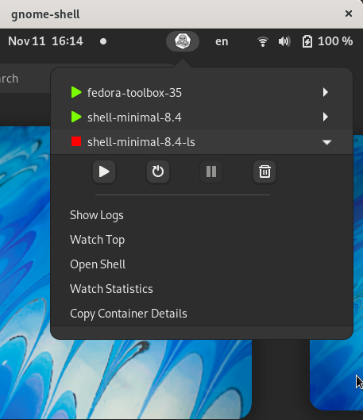

# GNOME Shell Extension: Containers

**Manage Podman containers seamlessly within GNOME Shell.**
  
  


## Features ✨

This extension provides a convenient GNOME Shell menu to manage your Podman containers. Supported actions include:

- **Start**: Initialize containers. 🚀
- **Stop**: Terminate running containers. 🛑
- **Remove**: Delete containers. 🗑️
- **Pause**: Suspend container processes. ⏸️
- **Restart**: Reboot containers. 🔄
- **Top Resources**: Display resource usage stats. 📊
- **Shell Access**: Open a terminal shell in the container. 🔧
- **Live Stats**: View real-time statistics in a new terminal. 📈
- **Logs Monitoring**: Follow logs in a new terminal session. 📋
- **Inspect Info**: View and copy detailed inspection information. 🔍

## Installation 🛠️

### From GNOME Extensions Page 🌐
You can install this extension directly from the [GNOME Extensions page](https://extensions.gnome.org/extension/1500/containers/).

### From Source 📂

1. **Clone the repository:**
   ```bash
   git clone https://github.com/rgolangh/gnome-shell-extension-containers
   cd gnome-shell-extension-containers
   ```
   
2. Build and install:

  ```bash
  make all
  ```

3. Enable the extension:

  ```bash
  make enable
  ```

Alternatively, enable it via Extensions -> Toggle 'Containers'.

## Preferences ⚙

- __*extra-info*__
  Show information about the container, see the screenshot
- __*terminal*__
  The terminal program to use when performing the `Show Logs`, `Watch Top`, `Open Shell`, and `Watch Statistics`

  Tested values:
  | value | notes |
  | ----- | ----- |
  |__*gnome-terminal --*__| default terminal program for all gnome version till 46, inclusive |
  |__*ptyxis --*__| default terminal program for gnome version from 47 onward |
  |__*kitty*__| no extra arguments needed |
  |__*flatpak run app.studiodev.Ptyxis --*__| Some flatpak environments doesn't have podman on the path |
  |__*flatpak run com.gexperts.Tilix -e*__| Some flatpak environments doesn't have podman on the path |

  Note: The value for __*terminal*__ may not work for you. Please report any working value you have so in time we would have a proper list.
  There is a system wide gsettings `org.gnome.desktop.default-applications.terminal exec` but depending on the value different args are needed, as seen from above.

- __*pod-list-sort-by*__
  Sort the pod list by one of the builtin fields:
    - command
    - created
    - id
    - image
    - names
    - runningfor
    - size
    - status

## Development / Contributing 🤝

To contribute to the development of this extension:

Clone the repository and make your changes.
Debugging: Spin up an inline GNOME Shell session in a dedicated window:
  
  ```bash
  make debug
  ```

Contributions are welcome! Please ensure your code follows the project’s style guidelines and is thoroughly tested before submitting a pull request.

## Screenshot 📸



## License 📜

Apache-2.0 License
